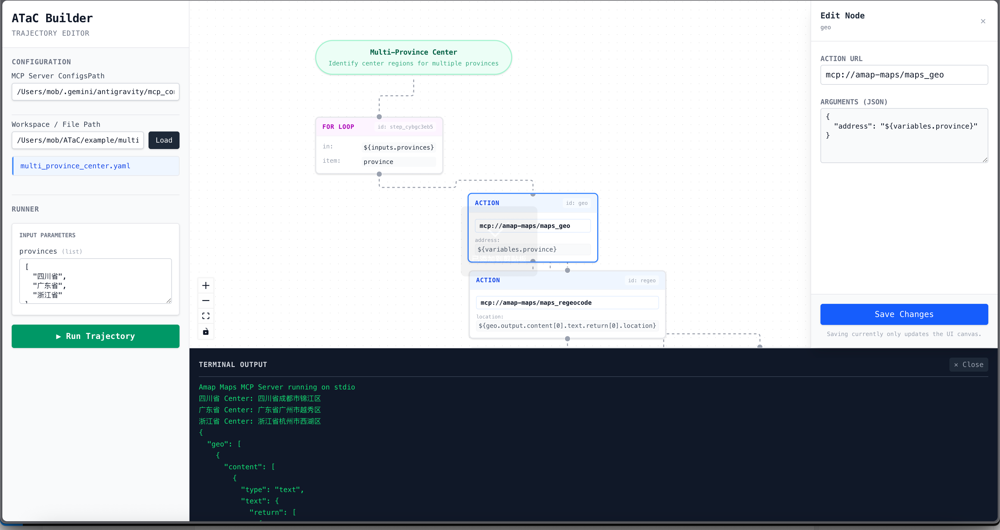

# ATaC (Agentic Trajectory as Code)

[English](#english) | [中文](#中文)

---

## 中文

ATaC (Agentic Trajectory as Code) 是一个专为 AI Agent 设计的**轨迹录制与回放工具**。它提供了一套标准化的**声明式智能体轨迹 DSL**，并提供了 **atac cli**、**atac mcp** 和 **atac skills**。目前的轨迹 DSL 已经支持了 MCP、Bash 和部分 Agent 的内置工具，将动态的 Agent 工具调用轨迹录制为可复用的 ATaC 静态资源。

### 🛠 核心能力
- **声明式控制流**: 在 YAML 中实现循环 (`for`) 和条件 (`if-else`) 逻辑。
- **多协议支持**: 统一驱动 `mcp://` (Model Context Protocol), `bash://` (Shell) 及 `kimi://` (Kimi 内置工具)。
- **Agent 编程接口**: 提供 CLI 指令，使 LLM 能够通过命令行自主构建、修改和执行复杂工作流。
- **可视化调试图谱**: 内置 Web UI (`atac ui`) 提供工作流运行时的可视化追踪调试功能。



### 📋 执行器兼容性
| 执行器 | 协议 | 状态 | 说明 |
| :--- | :--- | :--- | :--- |
| **MCP** | `mcp://` | ✅ 已支持 | 原生支持所有标准 MCP 服务 |
| **Bash** | `bash://` | ✅ 已支持 | 支持本地终端命令及脚本执行 |
| **Kimi / Moonshot**| `kimi://` | ✅ 已支持 | 支持 Kimi-CLI 所有的内置工具 |
| **Claude Code** | - | 🚧 规划中 | 待集成内置工具集 |

### 🤖 自动化构建示例 (CLI)

Agent 可以通过以下指令序列自主生成 `lookup.yaml` 轨迹文件：

```bash
# 1. 初始化并定义输入变量
atac init lookup.yaml --name "GeoSearch"
atac add-input lookup.yaml --name provinces --type list

# 2. 注入逻辑结构 (For 循环)
atac add-for lookup.yaml --in '${inputs.provinces}' --item province

# 3. 在指定位置插入动作 (支持路径寻址)
atac add-action lookup.yaml --at 0 --id geo --action "mcp://amap/maps_geo" --args '{"address": "${variables.province}"}'

# 4. 预览生成的结构
atac show lookup.yaml

```

### 🚀 快速开始

1. **安装**
```bash
uv tool install atac  # 推荐
# 或 pip install atac

```


2. **配置 MCP 环境**
```bash
export ATAC_MCP_SERVER_CONFIGS="path/to/mcp_config.json"

```


3. **执行轨迹**
```bash
atac run example/multi_province_center.yaml

```

4. **作为 MCP Server 启动**
任何支持 MCP 的客户端 (如 Claude Desktop 或 Cursor) 均可将 ATaC 作为工具集连接：
```json
{
  "mcpServers": {
    "atac": {
      "command": "atac",
      "args": ["mcp"],
      "env": {
        "ATAC_MCP_SERVER_CONFIGS": "path/to/mcp_config.json"
      }
    }
  }
}
```
*如果尚未在全局安装，也可以使用 `uvx` 直接运行（推荐）：*
```json
{
  "mcpServers": {
    "atac": {
      "command": "uvx",
      "args": ["atac", "mcp"],
      "env": {
        "ATAC_MCP_SERVER_CONFIGS": "path/to/mcp_config.json"
      }
    }
  }
}
```
---

## English

ATaC (Agentic Trajectory as Code) is an **Agent Trajectory Recording and Replay tool**. It provides a standardized **declarative Trajectory DSL** alongside **atac cli**, **atac mcp**, and **atac skills**. The trajectory DSL currently supports MCP, Bash, and some Agent built-in tools, recording dynamic Agent tool call trajectories into reusable static ATaC resources.

### 🛠 Key Features

* **Declarative Control Flow**: Native `for` and `if-else` support within YAML.
* **Multi-protocol Support**: Unified execution for `mcp://`, `bash://`, and `kimi://`.
* **Agentic Authoring**: CLI-first design allowing LLMs to programmatically build, refine, and execute their own workflows.
* **Visual Graph Debugging**: Built-in Web UI (`atac ui`) for runtime workflow visualization and minimal-design editing.


### 📋 Executor Support

| Executor | Scheme | Status | Note |
| --- | --- | --- | --- |
| **MCP** | `mcp://` | ✅ Supported | Native support for all MCP servers |
| **Bash** | `bash://` | ✅ Supported | Local shell commands and scripts |
| **Kimi / Moonshot** | `kimi://` | ✅ Supported | Full Kimi-CLI toolset support |
| **Claude Code** | - | 🚧 Roadmap | Built-in tool integration pending |

### 🤖 Authoring Flow (CLI)

Agents can generate a `lookup.yaml` trajectory via direct CLI commands:

```bash
atac init lookup.yaml --name "GeoSearch"
atac add-input lookup.yaml --name provinces --type list
atac add-for lookup.yaml --in '${inputs.provinces}' --item province
atac add-action lookup.yaml --at 0 --id geo --action "mcp://amap/maps_geo" --args '{"address": "${variables.province}"}'

```

### 🚀 Quick Start

1. **Installation**
```bash
uv tool install atac

```


2. **MCP Configuration**
```bash
export ATAC_MCP_SERVER_CONFIGS="path/to/mcp_config.json"

```


3. **Run**
```bash
atac run example/multi_province_center.yaml

```

4. **Run as MCP Server**
Any MCP-compatible client (like Claude Desktop or Cursor) can connect to ATaC to author and run trajectories:
```json
{
  "mcpServers": {
    "atac": {
      "command": "atac",
      "args": ["mcp"],
      "env": {
        "ATAC_MCP_SERVER_CONFIGS": "path/to/mcp_config.json"
      }
    }
  }
}
```
*If not installed globally, you can also use `uvx` directly (Recommended):*
```json
{
  "mcpServers": {
    "atac": {
      "command": "uvx",
      "args": ["atac", "mcp"],
      "env": {
        "ATAC_MCP_SERVER_CONFIGS": "path/to/mcp_config.json"
      }
    }
  }
}
```

### License

MIT