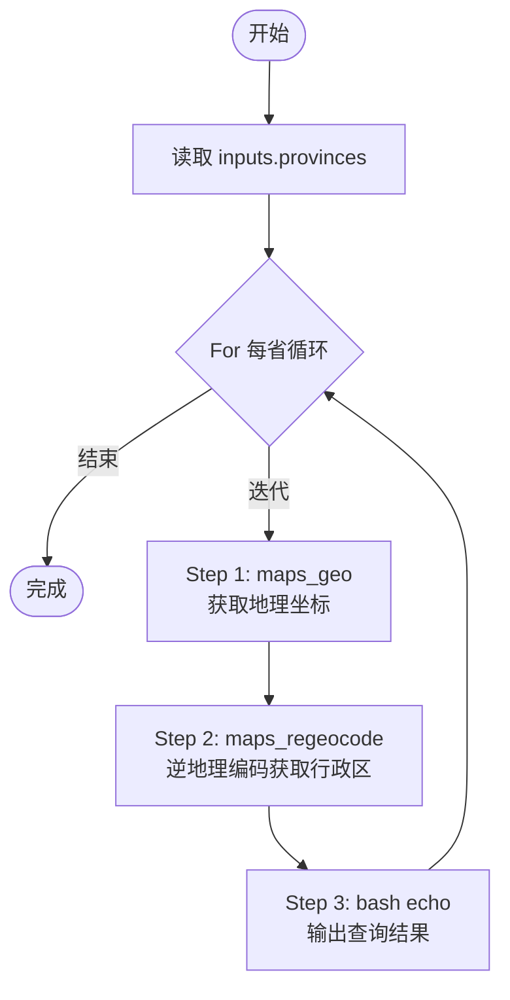
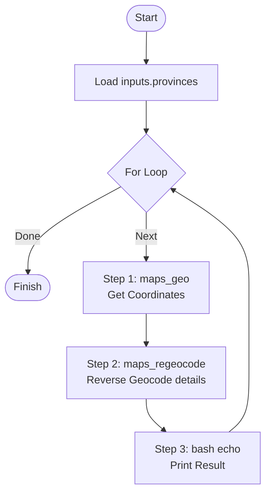

# ATaC (Agentic Trajectory as Code)

[English](#english) | [中文](#中文)

---

## 中文

ATaC 是一个专为 AI Agent 设计的声明式工作流 DSL 和 CLI 工具。它允许你将复杂的 Agent 行为（工具调用、条件判断、循环执行）定义为可分发、可复用的“轨迹码（Trajectory as Code）”。

### 🚀 核心特性
- **Agent 原生设计**: 面向LLM Agent，智能录制最优执行轨迹。
- **声明式 DSL**: 基于 YAML 定义工作流，支持循环 (`for`) 和条件判断 (`if-else`)。
- **多协议执行器**: 原生支持 `mcp://` (Model Context Protocol), `bash://` (系统终端) 以及 `kimi://` (AI Agent 内置工具) 等多种执行协议。

### 🛠 执行器支持矩阵 (Executor Support)
| 执行器 (Executor) | 协议 (Scheme) | 状态 (Status) | 说明 |
| :--- | :--- | :--- | :--- |
| **MCP** | `mcp://` | ✅ 已支持 | 原生支持所有符合 MCP 标准的服务 |
| **Bash** | `bash://` | ✅ 已支持 | 支持本地终端命令及脚本执行 |
| **Claude Code** | - | 🚧 待开发 | 欢迎社区贡献内置工具集成 |
| **Kimi / Moonshot**| `kimi://` | ✅ 已支持 | 支持 Kimi-CLI 所有的内置工具 |

### 🤖 Agent 自主构建流程 (Authoring Flow)

ATaC 的核心价值不仅是运行轨迹，更是让 Agent **拥有自主构建复杂逻辑的能力**。以下是 Agent 如何通过 CLI 命令逐步“录制”出一个轨迹的示例：

```bash
# 1. 初始化文件
atac init lookup.yaml --name "Province Search" --desc "Search coordinates"

# 2. 定义输入变量
atac add-input lookup.yaml --name provinces --type list --default '["四川省"]'

# 3. 构建循环结构
atac add-for lookup.yaml --in '${inputs.provinces}' --item province

# 4. 在循环内 (索引为 0) 插入工具调用
atac add-action lookup.yaml --at 0 --id geo --action "mcp://amap-maps/maps_geo" --args '{"address": "${variables.province}"}'

# 5. 预览生成的轨迹结构 (可视化寻址)
atac show lookup.yaml
# 输出:
# 0. for (in=${inputs.provinces}, item=province)
#   0.0. action (id=geo, tool=mcp://amap-maps/maps_geo)
```

### 🚀 快速开始

1. **安装 ATaC**
   推荐使用 [uv](https://docs.astral.sh/uv/) 进行隔离安装：
   ```bash
   uv tool install atac
   ```
   *(或者使用 `pip install atac`)*

2. **配置 MCP 服务 (以高德地图为例)**
   在 `mcp_config.json` 中添加服务并导出环境变量：
   ```json
   {
     "mcpServers": {
       "amap-maps": {
         "command": "npx",
         "args": ["-y", "@amap/amap-maps-mcp-server"],
         "env": { "AMAP_MAPS_API_KEY": "YOUR_API_KEY_HERE" }
       }
     }
   }
   ```
   ```bash
   export ATAC_MCP_SERVER_CONFIGS="path/to/mcp_config.json"
   ```

3. **集成技能到 Agent**
   将本项目中的技能文件夹复制到你的 Agent 技能目录中：
   ```bash
   cp -r skills/atac/ path/to/your/agent/skills/
   ```

4. **运行示例轨迹**
   ```bash
   atac run example/multi_province_center.yaml
   ```

### 🔍 轨迹深度解析 (Anatomy)

以 `example/multi_province_center.yaml` 为例，其内部执行流程如下：



| 步骤 ID | 类型 | 行为 | 数据流向 |
| :--- | :--- | :--- | :--- |
| `geo` | Action | 调用高德地图正向地理编码 | `${variables.province}` -> 坐标 |
| `regeo` | Action | 调用高德地图逆向地理编码 | `${geo.output...location}` -> 详细地址 |
| `log` | Action | 执行本地 Bash 命令 | 拼接 `${regeo.output...}` 并打印 |

### 🤝 贡献指南
我们欢迎各种形式的贡献！
1. **Fork** 本仓库并创建特性分支。
2. 确保所有更改都通过了 `pytest` 单测和 `ruff` 代码检查。
3. 提交 Pull Request，并详细描述你的更改。

---

## English

ATaC is a declarative workflow DSL and CLI tool designed specifically for AI Agents. It allows you to define complex agent behaviors—such as sequential tool calls, conditional branching, and iterative loops—as distributable and reusable "Trajectories as Code."

### 🚀 Key Features
- **Agent-Centric**: Built for LLM Agents, smart recording of optimal execution trajectories.
- **Declarative DSL**: Define workflows in YAML with built-in logic for `for` loops and `if-else` branches.
- **Multi-protocol Executors**: Native support for `mcp://` (Model Context Protocol), `bash://` (Shell), and `kimi://` (Agent Built-in Tools).

### 🛠 Executor Support Matrix
| Executor | Scheme | Status | Note |
| :--- | :--- | :--- | :--- |
| **MCP** | `mcp://` | ✅ Supported | Native support for all MCP servers |
| **Bash** | `bash://` | ✅ Supported | Run local terminal commands & scripts |
| **Claude Code** | - | 🚧 Pending | Community contributions are welcome! |
| **Kimi / Moonshot**| `kimi://` | ✅ Supported | Full support for Kimi-CLI built-in tools |

### 🤖 Agent Authoring Flow

The core value of ATaC is giving Agents the power to **programmatically build complex logic**. Here is how an Agent "records" a trajectory step-by-step using CLI commands:

```bash
# 1. Initialize the trajectory
atac init lookup.yaml --name "Province Search" --desc "Search coordinates"

# 2. Define input variables
atac add-input lookup.yaml --name provinces --type list --default '["Sichuan"]'

# 3. Create a loop structure
atac add-for lookup.yaml --in '${inputs.provinces}' --item province

# 4. Insert an action step inside the loop (index 0)
atac add-action lookup.yaml --at 0 --id geo --action "mcp://amap-maps/maps_geo" --args '{"address": "${variables.province}"}'

# 5. Inspect the structure (Visual Addressing)
atac show lookup.yaml
# Output:
# 0. for (in=${inputs.provinces}, item=province)
#   0.0. action (id=geo, tool=mcp://amap-maps/maps_geo)
```

### 📦 Quick Start

1. **Install ATaC**
   Recommended installation using [uv](https://docs.astral.sh/uv/):
   ```bash
   uv tool install atac
   ```
   *(Or use `pip install atac`)*

2. **Configure MCP (Example: Amap Maps)**
   Add the following to your `mcp_config.json` and export the path:
   ```json
   {
     "mcpServers": {
       "amap-maps": {
         "command": "npx",
         "args": ["-y", "@amap/amap-maps-mcp-server"],
         "env": { "AMAP_MAPS_API_KEY": "YOUR_API_KEY_HERE" }
       }
     }
   }
   ```
   ```bash
   export ATAC_MCP_SERVER_CONFIGS="path/to/mcp_config.json"
   ```

3. **Integrate Skills into Agent**
   Copy the `skills/atac/` directory provided in this project to your Agent's skill folder:
   ```bash
   cp -r skills/atac/ path/to/your/agent/skills/
   ```

4. **Run Example Trajectory**
   ```bash
   atac run example/multi_province_center.yaml
   ```

### 🔍 Trajectory Anatomy

Using `example/multi_province_center.yaml` as an example, here is how the execution flow works:



| Step ID | Type | Behavior | Data Flow |
| :--- | :--- | :--- | :--- |
| `geo` | Action | Amap Geocoding | `${variables.province}` -> Coordinates |
| `regeo` | Action | Amap Reverse Geocoding | `${geo.output...location}` -> Address Details |
| `log` | Action | Local Bash Command | Format & print `${regeo.output...}` |

### 🤝 Contributing
Contributions of any kind are welcome!
1. **Fork** the repository and create your feature branch.
2. Ensure all changes pass `pytest` unit tests and `ruff` linting.
3. Submit a Pull Request with a detailed description of your changes.

---

### License
MIT License.